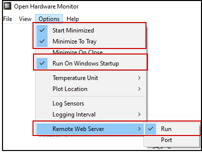

# ohw-mqtt

Continuously reads Open Hardware Monitor measurements from build in web-server JSON export and publishes to MQTT broker

## Installation

1. Install Open Hardware Monitor from https://openhardwaremonitor.org/
2. Recommended setup for Open Hardware Monitor
   * Start Minimized
   * Minimize to Tray
   * Run On Windows Startup
   * Remote Web Server -> Run

        


3. Install Node.js from https://nodejs.org/ , including NPM packet manager
4. Install Git from https://git-scm.com/ 

4. Use command-line to clone this repository to local machine folder and install dependencies
    ```
    git clone https://github.com/jacques42/ohw-mqtt ohw-mqtt
    cd ohw-mqtt
    npm install
    ```
    
## Usage

Command line options
```
  -h, --help               Display this usage guide.

  --jsonurl string         HTTP only URL to read the JSON data file from. Defaults to
                           http://127.0.0.1:8085/data.json

  --mqttBroker string      MQTT broker URL. Defaults to mqtt://127.0.0.1:1883

  --mqttUsername string    Specify MQTT username to enable authentication
  --mqttPassword string    Specify MQTT Password for authentication. Defaults to an empty string
  --mqttTopic string       Specify MQTT topic to publish on. Hostname will be appended. Defaults to
                           <hosts>

  -r, --raw                Send raw JSON data to MQTT. Any filter settings will be ignored.

  -f, --frequency number   Frequency to publish to MQTT in [s]. Default is 2

  --filterID string        List of comma-separated IDs to filter. First list item value defines whether
                           list elements are allowed (value = 1) or denied (value = 0). Example:
                           "0,80,82" denies measurement IDs 80 and 82
  --filterList string      List of comma-separated strings to filter. First list item value defines
                           whether list elements are allowed (value = allow) or denied (value = deny).
                           Example: "allow,Temperature, Mainboard" allows measurements to be published
                           where any node text in a given branch matches one of those strings

  -c, --cleanValues        Clean measurement values from all non-numeric characters
```
